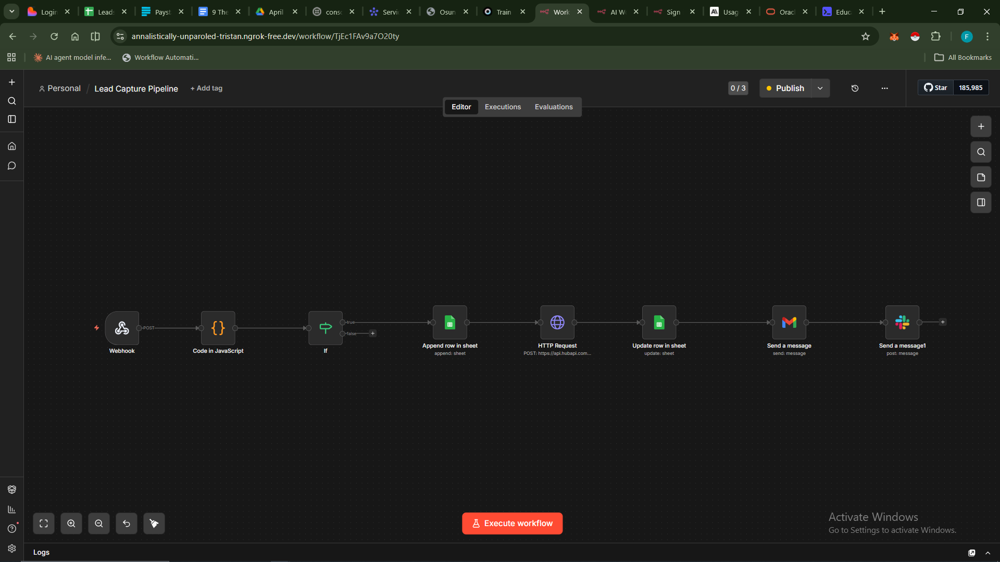
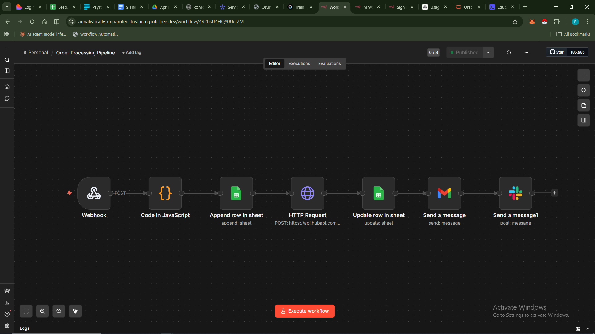
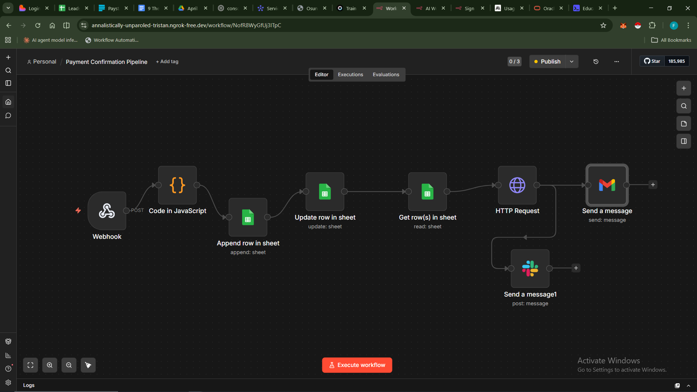

# 🛒 Lead-to-Revenue Automation System — FlowCart

> An end-to-end business automation that takes a customer from **website signup → order → payment confirmation** with zero manual intervention. Built with n8n, HubSpot, Paystack, Gmail, Google Sheets, Slack, and WhatsApp.

---

## 🚀 Live Demo

- **Website:** [flowcart.lovable.app](https://flowcart.lovable.app)
- **Automation Tool:** n8n (self-hosted)
- **CRM:** HubSpot

---

## 🧩 The Problem This Solves

Most small ecommerce businesses lose leads because:
- New signups are never followed up on
- Orders are tracked manually in spreadsheets
- Payment confirmations aren't sent automatically
- The sales team has no real-time visibility

This system automates the **entire lead-to-revenue journey** — from the moment someone signs up, to placing an order, to confirming payment — with every stakeholder notified at each step.

---

## ⚙️ How It Works — 3 Automated Workflows

### Workflow 1 — Lead Capture Pipeline
Triggered when a customer signs up on flowcart.lovable.app

```
Website Signup (Webhook)
  → Save lead to Google Sheets
  → Create/Update contact in HubSpot
  → Send personalised welcome email (Gmail)
  → Notify sales team on Slack
```


---

### Workflow 2 — Order Processing Pipeline
Triggered when a customer places an order

```
Order Webhook
  → Validate order data
  → Search HubSpot (existing contact? → Update : Create)
  → Create HubSpot Deal
  → Generate Paystack payment link
  → Save order to Google Sheets
  → Send order confirmation email with payment link
  → WhatsApp confirmation message
  → Notify sales team on Slack
```


---

### Workflow 3 — Payment Confirmation Pipeline
Triggered by Paystack webhook on successful payment

```
Paystack Payment Webhook
  → Verify payment signature
  → Update HubSpot Deal stage → "Won"
  → Update Google Sheets order → "Paid"
  → Send payment confirmation email to customer
  → Send WhatsApp thank you message
  → Notify sales team on Slack
```


---

## 🛠️ Tech Stack

| Tool | Role |
|------|------|
| [n8n](https://n8n.io) | Automation engine — orchestrates all 3 workflows |
| [HubSpot](https://hubspot.com) | CRM — contact and deal management |
| [Paystack](https://paystack.com) | Payment gateway — link generation and webhook |
| [Google Sheets](https://sheets.google.com) | Data store — leads and orders tracking |
| Gmail | Transactional emails — welcome, order, payment confirmation |
| Slack | Internal sales team notifications |
| WhatsApp (Twilio) | Customer-facing confirmation messages |
| [Lovable](https://lovable.app) | Frontend website — flowcart.lovable.app |

---

## 📁 Repo Structure

```
lead-to-revenue-automation/
├── workflows/
│   ├── workflow-1-lead-capture.json
│   ├── workflow-2-order-processing.json
│   └── workflow-3-payment-confirmation.json
├── screenshots/
│   ├── workflow-1-lead-capture.png
│   ├── workflow-2-order-processing.png
│   └── workflow-3-payment-confirmation.png
└── README.md
```

---

## 📦 How to Import the Workflows

1. Download the `.json` files from the `/workflows` folder
2. Open your n8n instance
3. Click **"Add workflow"** → **"Import from file"**
4. Select the `.json` file
5. Update credentials (HubSpot API key, Paystack secret key, Gmail OAuth, Slack webhook)
6. Activate the workflow

---

## 🔐 Environment / Credentials Needed

To run these workflows, you will need:

- **HubSpot** — Private App API token
- **Paystack** — Secret key + Webhook secret
- **Gmail** — OAuth2 credentials via Google Cloud Console
- **Slack** — Incoming Webhook URL
- **Twilio (WhatsApp)** — Account SID + Auth Token + WhatsApp-enabled number
- **Google Sheets** — OAuth2 or Service Account credentials

---

## 💡 Key Features

- **Duplicate detection** — searches HubSpot before creating a new contact
- **Webhook security** — Paystack webhook signature verification
- **Multi-channel notifications** — email + WhatsApp + Slack at every stage
- **Real-time CRM updates** — deal stages move automatically as customer progresses
- **Error handling** — every critical node has error routes

---

## 👤 Author

Built by Divine Favour(https://github.com/didi-devs)  

---

## 📄 License

MIT — free to use, adapt, and build on.
